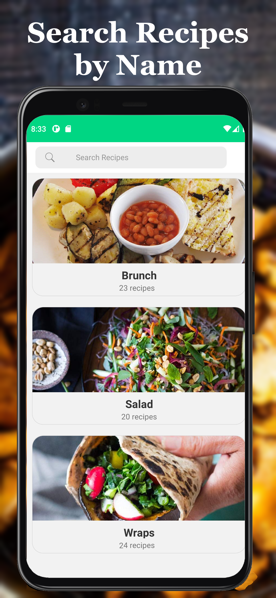
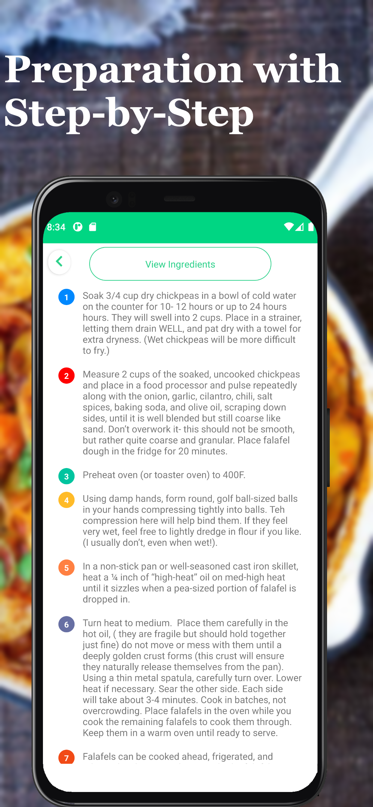

# VeganRecipe 🍆🍄🍠🍅

Hello! This project is a Vegan recipe application. I created with React Native. Check out VeganRecipe now for recipe app.

🍆🍄🍠🍅
Learn recipes with easy plant-based recipes with Veganish

<div align="center" style={{marginLeft:20}}>
    
    
    
   
</div>
<div align="center">
    
       
</div>

## Features
- Daily vegan recipes
- Search recipes by name
- Preparation with step-by-step instructions
- Food categories
- Easy to use interface
- 
#### Download
```console
git clone git@github.com:muratseven/react-native-vegan-recipes.git
cd react-native-vegan-recipes
```

#### Install dependencies
```console
npm install
```

#### Start metro bundler
```console
npm start
```
#### Android
```console
npm react-native run-android
```
### Dependencies
- [@react-native-async-storage/async-storage](https://github.com/react-native-async-storage/async-storage)
- [@react-native-community/masked-view](https://github.com/react-native-masked-view/masked-view)
- [@react-native-firebase/firestore](https://github.com/invertase/react-native-firebase/tree/main)
- [react-native-admob](https://github.com/sbugert/react-native-admob)
- [react-redux](https://github.com/reduxjs/react-redux)
- [react-native-gesture-handler](https://github.com/software-mansion/react-native-gesture-handler)
- [react-native-image-slider-box](https://github.com/intellidev1991/react-native-image-slider-box)
- [react-native-reanimated](https://github.com/software-mansion/react-native-reanimated)
- [react-native-searchbar](https://github.com/localz/react-native-searchbar)
- [react-native-skeleton-placeholder](https://github.com/chramos/react-native-skeleton-placeholder)
- [react-native-splash-screen](https://github.com/crazycodeboy/react-native-splash-screen)
- [react-native-vector-icons](https://github.com/oblador/react-native-vector-icons)

